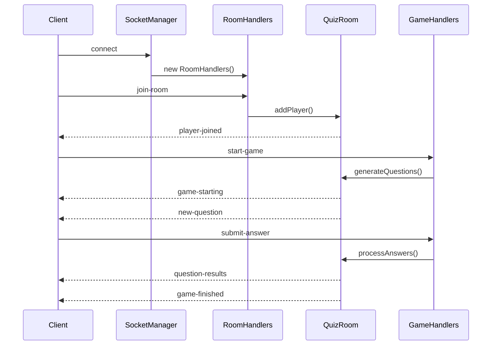

# Quiz Multijoueur Backend

Backend pour une application de quiz multijoueur en temps réel utilisant Socket.IO.

## 🚀 Démarrage rapide

```bash
# Installation des dépendances
npm install

# Démarrage en mode développement
npm run dev

# Démarrage en production
npm start
```

Le serveur démarre sur le port 3001 par défaut.

## 📋 Structure du projet

```
backend/
├── server.js                 # Point d'entrée principal
├── src/
│   ├── config/
│   │   ├── server.js         # Configuration du serveur Express + Socket.IO
│   │   └── database.js       # Configuration SQLite
│   ├── models/
│   │   ├── Game.js           # Modèle de partie
│   │   └── Player.js         # Modèle de joueur
│   ├── routes/
│   │   └── api.js            # Routes API REST
│   ├── services/
│   │   └── questionService.js # Service de génération de questions
│   ├── socket/
│   │   ├── socketManager.js  # Gestionnaire principal Socket.IO
│   │   ├── gameHandlers.js   # Gestionnaires d'événements de jeu
│   │   ├── roomHandlers.js   # Gestionnaires de salles
│   │   └── quizRoom.js       # Logique de salle de quiz
│   └── utils/
│       ├── constants.js      # Constantes et configuration
│       └── logger.js         # Système de logs
├── data/
│   └── quiz.db              # Base de données SQLite
└── logs/
    ├── app.log              # Logs d'application
    └── error.log            # Logs d'erreurs
```

## 🔧 Technologies utilisées

- **Express.js** - Framework web
- **Socket.IO** - Communication temps réel
- **SQLite3** - Base de données
- **OpenAI API** - Génération de questions
- **CORS** - Gestion des origines croisées
- **Winston** - Système de logs

## 🌐 Socket.IO - Architecture temps réel

### Configuration Socket.IO

Le serveur Socket.IO est configuré dans `src/config/server.js:18-25` avec CORS pour permettre les connexions cross-origin :

```javascript
this.io = socketIo(this.server, {
    cors: {
        origin: true,
        methods: ["GET", "POST", "PUT", "DELETE"],
        allowedHeaders: ["Content-Type"],
        credentials: false
    }
});
```

### Gestionnaire principal - SocketManager

Le `SocketManager` (`src/socket/socketManager.js`) orchestre tous les événements Socket.IO :

**Événements gérés :**
- `connection` - Nouvelle connexion client
- `join-room` - Rejoindre une salle
- `leave-room` - Quitter une salle
- `start-game` - Démarrer une partie
- `submit-answer` - Soumettre une réponse
- `get-leaderboard` - Obtenir le classement
- `disconnect` - Déconnexion client

### Gestion des salles - RoomHandlers

Les `RoomHandlers` (`src/socket/roomHandlers.js`) gèrent le cycle de vie des salles :

**Fonctionnalités :**
- Création/suppression automatique de salles
- Validation des pseudos (max 20 caractères, unicité)
- Gestion des déconnexions/reconnexions
- Notification temps réel des joueurs

**Événements émis :**
- `player-joined` - Nouveau joueur dans la salle
- `player-left` - Joueur a quitté la salle
- `joined-room` - Confirmation de connexion

### Logique de jeu - GameHandlers

Les `GameHandlers` (`src/socket/gameHandlers.js`) orchestrent le déroulement des parties :

**Démarrage de partie :**
- Vérification du nombre minimum de joueurs
- Configuration personnalisée (nombre de questions, temps par question)
- Génération des questions via OpenAI
- Compte à rebours de démarrage

**Gestion des réponses :**
- Enregistrement des réponses avec timestamp
- Calcul du score avec bonus de rapidité
- Détection de fin de question (tous ont répondu ou timeout)

**Événements émis :**
- `game-starting` - Démarrage avec compte à rebours
- `new-question` - Nouvelle question
- `question-results` - Résultats de la question
- `game-finished` - Fin de partie

### Salle de quiz - QuizRoom

La classe `QuizRoom` (`src/socket/quizRoom.js`) encapsule toute la logique d'une partie :

**États de jeu :**
- `waiting` - En attente de joueurs
- `starting` - Démarrage en cours
- `playing` - Partie en cours
- `finished` - Partie terminée

**Système de score :**
```javascript
const basePoints = 100;
const timeBonus = Math.max(0, (this.questionTimeLimit * 1000 - player.answerTime) / 100);
points = Math.round(basePoints + timeBonus);
```

**Génération de questions :**
- Utilisation de l'API OpenAI via `QuestionService`
- Questions de secours (fallback) si l'API échoue
- Catégories personnalisables

## 📡 API REST

### Endpoints disponibles

**GET /api/health**
- Vérification de l'état du serveur

**GET /api/stats**
- Statistiques globales des parties

**GET /api/recent-games**
- Liste des parties récentes
- Paramètre : `?limit=10`

**GET /api/games/:id**
- Détails d'une partie spécifique
- Inclut joueurs et questions

## 🗄️ Base de données

Utilise SQLite3 avec les modèles suivants :

### Game Model
- `id`, `roomName`, `category`
- `playersCount`, `questionsCount`
- `status`, `createdAt`, `completedAt`

### Player Model
- `id`, `gameId`, `username`
- `socketId`, `score`, `finalRank`

## 🔄 Flux de communication Socket.IO



## 🚦 Gestion des erreurs

### Logging
- Logs structurés avec Winston
- Séparation app.log / error.log
- Niveaux : info, error, debug

### Validation
- Validation des données d'entrée Socket.IO
- Gestion des déconnexions intempestives
- Nettoyage automatique des salles vides

## ⚙️ Configuration

### Variables d'environnement
```bash
PORT=3001                    # Port du serveur
OPENAI_API_KEY=your_key     # Clé API OpenAI
NODE_ENV=production         # Environnement
```

### Constantes configurables
- `MIN_PLAYERS` : Nombre minimum de joueurs (2)
- `QUESTION_TIME_LIMIT` : Temps par question (30s)
- `DEFAULT_QUESTIONS` : Nombre de questions par défaut (10)
- `GAME_START_COUNTDOWN` : Compte à rebours de démarrage (3s)

## 🔧 Scripts disponibles

```bash
npm start       # Démarrage production
npm run dev     # Développement avec nodemon
npm test        # Tests avec Jest
npm run migrate # Migration base de données
```

## 🌟 Fonctionnalités Socket.IO

### Temps réel
- Synchronisation automatique des joueurs
- Mise à jour instantanée des scores
- Notifications de connexion/déconnexion

### Robustesse
- Gestion des déconnexions
- Nettoyage automatique des ressources
- Questions de secours en cas d'échec API

### Scalabilité
- Architecture modulaire
- Gestion multi-salles
- Optimisations mémoire

## 📈 Monitoring

- Logs détaillés de chaque action
- Tracking des performances
- Métriques de jeu en temps réel

---

*Ce backend fournit une base solide pour un quiz multijoueur avec Socket.IO, gérant de manière robuste les connexions temps réel et la logique de jeu.*