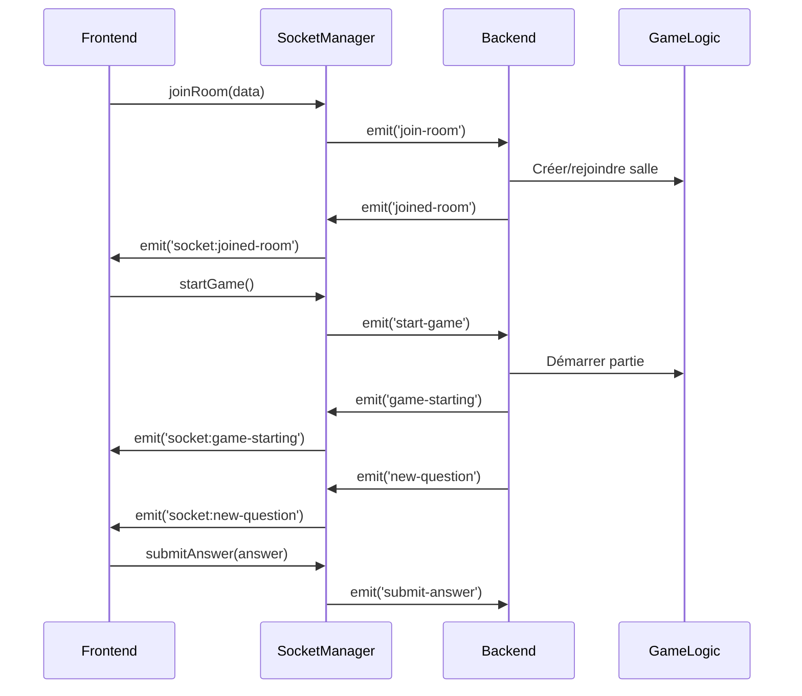

# Quiz Multijoueur Frontend

Interface utilisateur moderne pour une application de quiz multijoueur temps réel basée sur Socket.IO.

## 🚀 Démarrage rapide

```bash
# Servir le frontend (depuis le dossier frontend/public)
python -m http.server 8000
# ou
npx serve .
# ou utiliser n'importe quel serveur web statique
```

L'application sera accessible sur `http://localhost:8000`

## 📁 Structure du projet

```
frontend/
├── public/
│   ├── index.html              # Point d'entrée HTML
│   ├── css/
│   │   ├── main.css           # Styles principaux et variables
│   │   ├── components.css     # Styles des composants UI
│   │   └── animations.css     # Animations et transitions
│   ├── js/S
│   │   ├── app.js            # Point d'entrée principal
│   │   ├── components/
│   │   │   ├── SocketManager.js    # 🔥 Gestionnaire WebSocket
│   │   │   ├── ScreenManager.js    # Navigation entre écrans
│   │   │   └── UIManager.js        # Interface utilisateur
│   │   ├── screens/
│   │   │   ├── LoginScreen.js      # Écran de connexion
│   │   │   ├── LobbyScreen.js      # Salle d'attente
│   │   │   ├── CountdownScreen.js  # Compte à rebours
│   │   │   ├── GameScreen.js       # Jeu principal
│   │   │   ├── ResultsScreen.js    # Résultats question
│   │   │   └── FinalScreen.js      # Résultats finaux
│   │   └── utils/
│   │       ├── constants.js        # Configuration et constantes
│   │       └── helpers.js          # Utilitaires
│   └── libs/
│       └── socket.io.min.js       # Bibliothèque Socket.IO
└── README.md                      # Ce fichier
```

## 🌐 Architecture WebSocket - Point Central

### SocketManager - Cœur de la Communication Temps Réel

Le `SocketManager` (`js/components/SocketManager.js`) est le composant central qui gère toute la communication WebSocket avec le backend.

#### Configuration et Connexion

```javascript
class SocketManager {
    constructor() {
        this.socket = null;
        this.serverUrl = CONFIG.SERVER_URL;  // Configuration dynamique
        this.eventHandlers = new Map();     // Système d'événements personnalisé
    }

    connect() {
        this.socket = io(this.serverUrl);
        // Configuration automatique des gestionnaires d'événements
    }
}
```

**Détection d'environnement automatique :**
- `localhost` → `http://localhost:3001` (développement)
- `staging/dev` → `http://15.236.224.68:3001` (staging)  
- Production → `http://15.236.224.68:3001`

#### Événements WebSocket Gérés

**🔌 Connexion/Déconnexion :**
```javascript
this.socket.on('connect', () => {
    this.emit('app:connected');
});

this.socket.on('disconnect', () => {
    this.emit('app:disconnected');
});

this.socket.on('connect_error', (error) => {
    this.emit('app:connection-error', error);
});
```

**🏠 Gestion des Salles :**
```javascript
// Rejoindre une salle
this.socket.on('joined-room', (data) => {
    this.emit('socket:joined-room', data);
});

// Notifications de joueurs
this.socket.on('player-joined', (data) => {
    this.emit('socket:player-joined', data);
});

this.socket.on('player-left', (data) => {
    this.emit('socket:player-left', data);
});
```

**🎮 Événements de Jeu :**
```javascript
// Démarrage de partie
this.socket.on('game-starting', (data) => {
    this.emit('socket:game-starting', data);
});

// Questions et réponses
this.socket.on('new-question', (data) => {
    this.emit('socket:new-question', data);
});

this.socket.on('question-results', (data) => {
    this.emit('socket:question-results', data);
});

// Fin de partie
this.socket.on('game-finished', (data) => {
    this.emit('socket:game-finished', data);
});
```

#### Système d'Événements Personnalisé

Le SocketManager implémente un système d'événements qui découple la logique WebSocket des composants UI :

```javascript
// S'abonner à un événement
socketManager.on('socket:new-question', (data) => {
    // Traiter la nouvelle question
});

// Émettre un événement
socketManager.emit('app:connected');

// Se désabonner
socketManager.off('socket:new-question', handler);
```

#### Méthodes d'Émission vers le Serveur

```javascript
// Rejoindre une salle
joinRoom(roomData) {
    this.socket.emit('join-room', roomData);
}

// Démarrer une partie (host uniquement)
startGame(config = {}) {
    this.socket.emit('start-game', config);
}

// Soumettre une réponse
submitAnswer(answer) {
    this.socket.emit('submit-answer', { answer });
}

// Quitter la salle
leaveRoom() {
    this.socket.emit('leave-room');
}
```

### Flux de Communication WebSocket



## 🎯 Écrans et Navigation

### ScreenManager - Navigation Fluide

Le `ScreenManager` gère la navigation entre les différents écrans de l'application :

```javascript
// Navigation programmatique
screenManager.showScreen('lobby', roomData);
screenManager.showScreen('game', questionData);
screenManager.showScreen('final', resultsData);
```

### Cycle de Vie des Écrans

Chaque écran implémente l'interface :

```javascript
class Screen {
    init()           // Initialisation une seule fois
    render(data)     // Génération du HTML
    show(data)       // Affichage et événements
    hide()           // Nettoyage et suppression d'événements
}
```

### Écrans Principaux

#### 1. LoginScreen - Connexion
- **WebSocket :** Écoute `socket:joined-room` et `socket:error`
- **Actions :** Validation des données, connexion à la salle
- **Navigation :** Vers `LobbyScreen` après connexion réussie

#### 2. LobbyScreen - Salle d'Attente  
- **WebSocket :** Écoute `socket:player-joined`, `socket:player-left`, `socket:game-starting`
- **Actions :** Gestion des joueurs, configuration de partie (host)
- **Navigation :** Vers `CountdownScreen` au démarrage

#### 3. CountdownScreen - Compte à Rebours
- **WebSocket :** Transition automatique après le décompte
- **Navigation :** Vers `GameScreen` automatiquement

#### 4. GameScreen - Jeu Principal 🎮
- **WebSocket :** Écoute `socket:new-question`, `socket:question-results`, `socket:game-finished`
- **Actions :** Affichage des questions, gestion des réponses, timer
- **Fonctionnalités :**
  - Timer temps réel synchronisé
  - Boutons de réponse interactifs avec animations
  - Support clavier (1-4, A-D, Enter, Espace)
  - États visuels (sélectionné, correct, incorrect)

#### 5. ResultsScreen - Résultats Question
- **WebSocket :** Affichage des scores intermédiaires
- **Navigation :** Vers `GameScreen` (question suivante) ou `FinalScreen`

#### 6. FinalScreen - Résultats Finaux
- **WebSocket :** Affichage du classement final et statistiques
- **Actions :** Nouvelle partie, retour au lobby

## 🎨 Interface Utilisateur

### Système de Design

**Variables CSS centralisées :**
```css
:root {
    --primary-color: #2d3748;        /* Couleur principale (sombre) */
    --primary-dark: #1a202c;         /* Couleur principale foncée */
    --secondary-color: #4a5568;      /* Couleur secondaire */
    --success-color: #2f855a;        /* Succès */
    --error-color: #c53030;          /* Erreur */
}
```

### Composants UI Avancés

#### Boutons de Réponse Améliorés 🎯

Les boutons de réponse offrent une expérience utilisateur premium :

**États visuels :**
- **Hover :** Élévation, ombres, animations fluides
- **Sélectionné :** Gradient, pulsation, checkmark
- **Correct :** Vert avec animation de réussite
- **Incorrect :** Rouge avec animation d'erreur

**Fonctionnalités :**
- **Lettres indicatives :** A, B, C, D avec animations
- **Raccourcis clavier :** 1-4, A-D pour sélection rapide
- **Accessibilité :** ARIA labels, navigation clavier
- **Responsive :** Adaptation mobile/desktop

**Code exemple :**
```css
.answer-btn {
    position: relative;
    padding: 1.5rem 1.25rem;
    border: 3px solid var(--gray-300);
    background: linear-gradient(145deg, #ffffff 0%, #f8fafc 100%);
    transition: all 0.4s cubic-bezier(0.4, 0, 0.2, 1);
    transform-origin: center;
}

.answer-btn:hover {
    transform: translateY(-4px) scale(1.02);
    box-shadow: 0 8px 25px rgba(45, 55, 72, 0.2);
}
```

### Animations et Transitions

**Animations CSS avancées :**
- Transitions fluides entre écrans
- Animations de chargement
- Effets de hover sophistiqués
- Feedback visuel temps réel

**Exemple d'animation de sélection :**
```css
@keyframes selectedPulse {
    0% { transform: translateY(-2px) scale(1.02); }
    50% { transform: translateY(-4px) scale(1.05); }
    100% { transform: translateY(-2px) scale(1.02); }
}
```

## 🔄 Gestion d'État Temps Réel

### Synchronisation Client-Serveur

L'application maintient la synchronisation grâce à :

1. **Événements bidirectionnels** via Socket.IO
2. **Gestion d'état locale** pour les performances
3. **Réconciliation automatique** en cas de désynchronisation
4. **Reconnexion automatique** en cas de perte de connexion

### Exemple de Synchronisation

```javascript
// GameScreen - Synchronisation des questions
handleNewQuestion(data) {
    this.currentQuestion = data;
    this.hasAnswered = false;
    this.timeLeft = data.timeLimit;
    
    // Mise à jour de l'UI
    this.updateUI(data);
    this.startTimer();
}

// LobbyScreen - Synchronisation des joueurs  
handlePlayerJoined(data) {
    this.players = data.players;
    this.updatePlayersList();
    this.showNotification(`${data.username} a rejoint la salle`);
}
```

## 📱 Responsive Design

L'interface s'adapte automatiquement à tous les écrans :

- **Desktop :** Interface complète avec sidebar
- **Tablet :** Layout adaptatif avec colonnes flexibles
- **Mobile :** Interface simplifiée, navigation optimisée
- **Touch :** Boutons de taille optimale pour le tactile

## 🔧 Configuration

### Variables d'Environnement

```javascript
const CONFIG = {
    SERVER_URL: getServerUrl(),           // URL du serveur automatique
    SOCKET_TIMEOUT: 10000,               // Timeout de connexion
    MAX_USERNAME_LENGTH: 20,             // Longueur max pseudo
    MAX_ROOM_NAME_LENGTH: 20,            // Longueur max nom de salle
};
```

### Catégories de Quiz

```javascript
const CATEGORIES = {
    'général': '🌍 Culture Générale',
    'science': '🧬 Science & Technologie',
    'histoire': '📚 Histoire',
    'géographie': '🗺️ Géographie',
    'sport': '⚽ Sport',
    'cinéma': '🎬 Cinéma & TV',
    'musique': '🎵 Musique',
    'littérature': '📖 Littérature'
};
```

## 🚀 Fonctionnalités Temps Réel

### Timer Synchronisé

Le timer de questions est synchronisé entre tous les clients :

```javascript
startTimer() {
    this.timer = setInterval(() => {
        this.timeLeft--;
        this.updateTimerDisplay();
        
        if (this.timeLeft <= 0) {
            this.stopTimer();
            // Soumission automatique si pas de réponse
        }
    }, 1000);
}
```

### Notifications En Temps Réel

```javascript
// Notification de joueur rejoignant
socketManager.on('socket:player-joined', (data) => {
    uiManager.showNotification(`${data.username} a rejoint`, 'success');
});

// Notification de démarrage de partie
socketManager.on('socket:game-starting', (data) => {
    uiManager.showNotification('La partie commence !', 'info');
});
```

### Partage de Salle

```javascript
shareRoom() {
    const roomUrl = `${window.location.origin}?room=${encodeURIComponent(this.roomData.roomName)}`;
    
    if (navigator.share) {
        navigator.share({
            title: 'Quiz Multijoueur',
            text: `Rejoignez ma salle de quiz : ${this.roomData.roomName}`,
            url: roomUrl
        });
    } else {
        // Fallback: copier dans le presse-papier
        navigator.clipboard.writeText(roomUrl);
        this.showNotification('Lien copié !', 'success');
    }
}
```

## 🎯 Optimisations Performances

### Gestion Mémoire

- **Event listeners :** Nettoyage automatique lors du changement d'écran
- **Timers :** Arrêt systématique des intervalles
- **WebSocket :** Gestion propre des déconnexions

```javascript
hide() {
    this.stopTimer();
    this.removeEventListeners();
    // Nettoyage complet des ressources
}
```

### Optimisations Réseau

- **Debouncing :** Pour les inputs utilisateur
- **Event delegation :** Pour les interactions UI
- **Reconnexion intelligente :** En cas de perte de connexion

## 🧪 Debug et Développement

### Logs de Debug

```javascript
// SocketManager avec logs conditionnels
console.log('🔌 Socket connecté');
console.log('📨 Émission:', event, data);
console.log('📬 Réception:', event, data);
```

### Outils de Développement

- **Console du navigateur :** Inspection des événements Socket.IO
- **Network tab :** Monitoring des WebSocket frames
- **Application tab :** Inspection du localStorage

## 🌟 Fonctionnalités Avancées

### Accessibilité

- **Support clavier complet** pour toutes les interactions
- **ARIA labels** pour les lecteurs d'écran  
- **Contraste élevé** respectant les standards WCAG
- **Focus management** intelligent

### Progressive Web App

- **Responsive design** natif
- **Offline handling** avec messages informatifs
- **Performance optimisée** pour mobile

### Personnalisation

- **Thème sombre** avec variables CSS
- **Animations configurables** 
- **Sauvegarde préférences** en localStorage

---

## 📚 API WebSocket

### Événements Émis par le Client

| Événement | Données | Description |
|-----------|---------|-------------|
| `join-room` | `{username, roomName, category}` | Rejoindre une salle |
| `start-game` | `{questionsCount, timePerQuestion}` | Démarrer une partie (host) |
| `submit-answer` | `{answer}` | Soumettre une réponse (0-3) |
| `leave-room` | - | Quitter la salle |

### Événements Reçus du Serveur

| Événement | Données | Description |
|-----------|---------|-------------|
| `joined-room` | `{roomName, category, players, isHost}` | Connexion réussie |
| `player-joined` | `{username, players, playersCount}` | Nouveau joueur |
| `player-left` | `{username, players, playersCount}` | Joueur parti |
| `game-starting` | `{countdown}` | Début de partie |
| `new-question` | `{question, options, questionNumber, timeLimit}` | Nouvelle question |
| `question-results` | `{correctAnswer, results, leaderboard}` | Résultats question |
| `game-finished` | `{finalResults, gameStats}` | Fin de partie |
| `error` | `{message}` | Erreur serveur |

---

*Cette architecture WebSocket garantit une expérience multijoueur fluide et synchronisée, avec une interface utilisateur moderne et accessible pour tous les types d'appareils.* 🚀